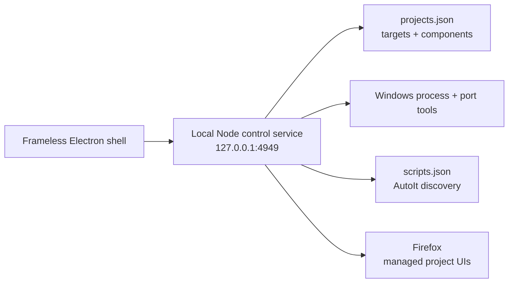

<p align="center">
  
</p>

<h1 align="center">Hacker's Lair</h1>

<p align="center">
  <strong>A frameless Windows command room for projects, localhost ports, and automation scripts.</strong>
</p>

<p align="center">
  
  
  
  
</p>

Hacker's Lair turns a Windows development machine into one focused process
console. Start an entire project, inspect the ports currently listening, launch
local scripts, and open managed web UIs in Firefox without bouncing between
terminal windows, Task Manager, and browser bookmarks.

The interface runs inside a custom Electron shell with its own titlebar,
window controls, and scrollbar. The control service listens only on
`127.0.0.1`.

## Control surfaces

| Surface | What it controls |
|---|---|
| **Targets** | Starts or stops every configured component of a project as one unit, while retaining component-level status and logs. |
| **Port Signals** | Shows listening localhost ports, labels known development servers, stops processes, and relaunches processes previously stopped by the console. |
| **Scripts** | Discovers configured AutoIt scripts live and starts or stops them from the same interface. |
| **Intel Rack** | Tracks live and dormant targets, CPU and memory pressure, recent commands, and current control state. |
| **Signal Tape** | Keeps an operator-readable event feed for starts, stops, refreshes, and failures. |
| **Cinematic shell** | Runs a short secure-boot handoff, ambient signal rain, scan passes, and subtle operator-mark activity without covering the controls. |

Managed project UIs are opened explicitly in **Firefox**, independent of the
Windows default browser. Set `FIREFOX_PATH` only when Firefox is installed
outside a standard Windows location.

## Architecture



The Node service uses built-in modules and Windows tools such as `netstat`,
`tasklist`, and `taskkill`. Electron is the only npm dependency.

## Quick start

### Requirements

- Windows 11
- Node.js 18 or newer
- Firefox
- AutoIt 3 only if you want to use the Scripts surface

### Install the desktop app

```powershell
git clone https://github.com/alfonza1/hackers-lair.git
Set-Location hackers-lair
npm install
powershell -ExecutionPolicy Bypass -File .\install.ps1
```

The installer creates Start menu and Desktop shortcuts named **Hacker's Lair**
and registers a silent login-time launcher for the local service. Press the
Windows key, type `Hacker's Lair`, and launch it like any other desktop app.

Re-run `install.ps1` after moving the repository. Use `uninstall.ps1` to remove
the shortcuts and login launcher.

### Run without installing shortcuts

```powershell
npm start
```

For debugging, run the service and desktop host separately:

```powershell
npm run server
npm run desktop
```

The service-only UI is also available at <http://localhost:4949>.

## Configure projects

`projects.json` defines each target and its frontend, backend, or headless
components. Paths and commands are intentionally explicit because detection is
based on the process command line, not only a port number.

```json
{
  "name": "incident-sim",
  "type": "Node monorepo",
  "components": [
    {
      "name": "backend",
      "role": "backend",
      "cwd": "C:\\Code\\incident-sim\\backend",
      "command": "npm run dev",
      "port": 4000,
      "match": "C:\\Code\\incident-sim\\backend"
    },
    {
      "name": "frontend",
      "role": "frontend",
      "cwd": "C:\\Code\\incident-sim\\frontend",
      "command": "npm run dev",
      "port": 5173,
      "match": "C:\\Code\\incident-sim\\frontend"
    }
  ]
}
```

- `cwd` is the component's working directory.
- `command` is launched inside `cwd` in a detached, hidden process.
- `port` is the expected listening port and is used as a display hint.
- `match` is a distinctive substring in the process command line. An absolute
  project path is the safest default.
- `track: "process"` supports headless components that never bind a port.

The service reloads `projects.json` on every request, so configuration edits do
not require a restart. Replace the checked-in Windows paths with paths for your
own workspace after cloning.

## Configure scripts

`scripts.json` points to an AutoIt executable and script directory. Every
`.au3` file in that directory appears automatically, newest modified first.
Descriptions are optional and keyed by filename:

```json
{
  "scriptsDir": "C:\\Scripts\\autoit",
  "autoItExe": "C:\\Program Files (x86)\\AutoIt3\\AutoIt3.exe",
  "descriptions": {
    "watchdog.au3": "Monitors the active session and exits when its stop condition is met."
  }
}
```

## Repository map

| Path | Responsibility |
|---|---|
| `public/index.html` | Complete Process Control interface and browser-side behavior |
| `server.js` | Local HTTP service, process discovery, launch, stop, and log APIs |
| `desktop.js` | Frameless Electron window lifecycle |
| `preload.js` | Restricted bridge for in-app window controls |
| `projects.json` | Project and component launch configuration |
| `scripts.json` | AutoIt discovery and description configuration |
| `launcher.vbs` | Silent service bootstrap and desktop launcher |
| `install.ps1` / `uninstall.ps1` | Windows shortcut and login registration |
| `make-icon.ps1` / `icon.ico` | Native Hacker's Lair app icon |

## Operational notes

- Runtime logs live under `logs/` and are ignored by Git.
- `started.json` and `stopped.json` retain local launch state and are ignored by
  Git.
- A component startup failure stays visible on its target with the error and a
  link to the full log.
- Closing the Electron window leaves the local service running so the next
  launch is immediate.
- Cinematic effects pause when the app is hidden and are disabled when Windows
  reduced-motion preferences are enabled.

> [!IMPORTANT]
> Process stop actions are real Windows process operations. Keep each `match`
> value distinctive so a target cannot match an unrelated command line.
