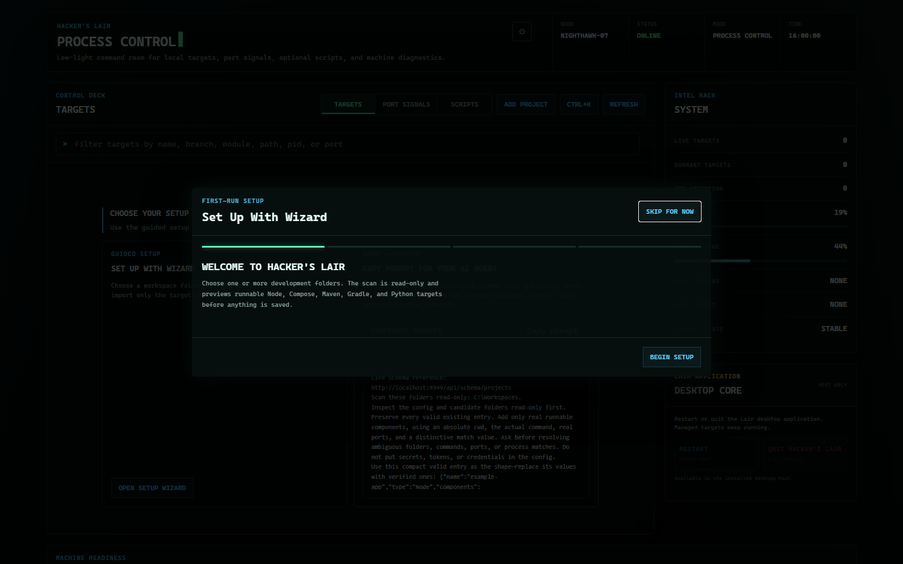

<p align="center">
  
</p>

<h1 align="center">Hacker's Lair</h1>

<p align="center">
  <strong>Local developer process control for Windows and Linux.</strong>
</p>

Hacker's Lair is a desktop control room for projects, localhost ports,
processes, logs, and recovery. Start a complete frontend/backend/worker stack,
see what owns a conflicting port, open a detected dev URL, and stop the right
process without bouncing between terminals and system tools.

It runs locally, requires no account, and sends no telemetry. End-user packages
bundle Electron and Node; developers installing the app do not install Node.js
or clone this repository.

**Website and full documentation:**
[alfonza1.github.io/hackers-lair](https://alfonza1.github.io/hackers-lair/)

## Install

The website is command-only. Release files remain on GitHub with SHA256
checksums; there are no browser download buttons.

### Windows

Winget, after the community manifest is approved:

```powershell
winget install --id Alfonza1.HackersLair --exact
```

Checksum-verifying PowerShell channel:

```powershell
irm https://alfonza1.github.io/hackers-lair/install.ps1 | iex
```

Scoop, after the public bucket is created:

```powershell
scoop bucket add hackerslair https://github.com/alfonza1/hackers-lair-scoop
scoop install hackerslair
```

### Linux

Debian / Ubuntu:

```bash
curl -LO https://github.com/alfonza1/hackers-lair/releases/latest/download/hackers-lair_amd64.deb && sudo apt install ./hackers-lair_amd64.deb
```

Fedora / RHEL:

```bash
curl -LO https://github.com/alfonza1/hackers-lair/releases/latest/download/hackers-lair_x86_64.rpm && sudo rpm -i ./hackers-lair_x86_64.rpm
```

See the [installation guide](https://alfonza1.github.io/hackers-lair/docs/)
for the distro-neutral tarball, updates, checksums, and clean uninstall.

## First launch

The empty Targets view offers two equal paths:

- **Set up with wizard** — choose workspace folders, preview discovered Node,
  Compose, Maven, Gradle, and Python projects, then import only the targets you
  approve.
- **Copy prompt for your AI agent** — copy a machine-aware, agent-agnostic
  setup prompt containing the live config/schema locations, selected folders,
  one valid example, safety rules, and CLI verification commands.

The in-app editor handles add, edit, and remove actions with duplicate-port,
missing-folder, and schema validation. Normal use never requires hand-edited
JSON.



## What it controls

- Complete multi-component project start/stop with per-target action locks.
- Truthful detected URLs and configured-port chips.
- Port-conflict ownership with deliberate kill-and-retry.
- Live logs, crash state, optional capped auto-restart, and dormant-process
  warnings.
- CPU and RAM history only when enough real samples exist.
- Git attention from an asynchronous read-only scan.
- Project discovery, templates, full forms, JSON Schema, ten config backups,
  import/export redaction, and Doctor reports.
- Command palette (`Ctrl+K`), tray controls, global summon shortcut
  (`Ctrl+Shift+L`), and `lair` terminal companion.
- Curated phosphor, amber, ice, crimson, and high-contrast ghost themes.


## Local security boundary

The Electron host starts and owns the control service. It binds to
`127.0.0.1`, records the actual drift-safe port, per-launch nonce, PID, and
random mutation token in the user data directory, and verifies that identity
before loading the UI.

Every POST requires the private token and `application/json`. Host headers are
restricted to the actual localhost origin, IPC senders are origin-checked, and
the packaged page uses a restrictive Content Security Policy. Config parse
failures retain the last known-good value and surface a visible error.

The current release artifacts are checksum-published and carry GitHub build
provenance, but remain unsigned. See [SECURITY.md](SECURITY.md) and
[SIGNING.md](SIGNING.md); the project does not self-sign distribution packages
or tell users to disable operating-system security.

## CLI

The packaged companion reads the same rotating identity record and talks only
to the verified local service:

```text
lair ls
lair start "My Project"
lair stop "My Project"
lair open "My Project"
lair doctor
lair backups
lair restore <backup-file>
```

## Development

Repository development requires Node.js 22.12 or newer. This is the only path
that uses git and npm:

```powershell
git clone https://github.com/alfonza1/hackers-lair.git
Set-Location hackers-lair
npm ci
npm test
npm start
```

Build and smoke-test the self-contained Windows package:

```powershell
npm run package
npm run smoke:package
npm run smoke:install
npm run make
```

Forge produces the Squirrel installer and portable ZIP on Windows, plus DEB,
RPM, and ZIP packages on Linux. The release workflow adds the Linux tarball.
CI reports built-in Node coverage on both operating systems, runs a headless
Playwright UI smoke, and exercises packaged lifecycle recovery. Tagged builds
repeat those gates before creating the GitHub Release, checksums, provenance,
and package-channel manifests. Pushes to `main` deploy the pure-static `site/`
directory to GitHub Pages.

See [TESTING.md](TESTING.md) for clean-VM acceptance steps and
[distribution/WINGET.md](distribution/WINGET.md) for the one manual community
manifest submission. Contributor workflow and compatibility rules live in
[CONTRIBUTING.md](CONTRIBUTING.md), [VERSIONING.md](VERSIONING.md), and
[CHANGELOG.md](CHANGELOG.md).

## License

MIT © 2026 Alfonza Jones
