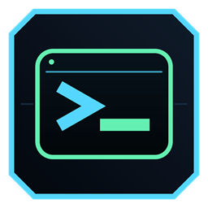
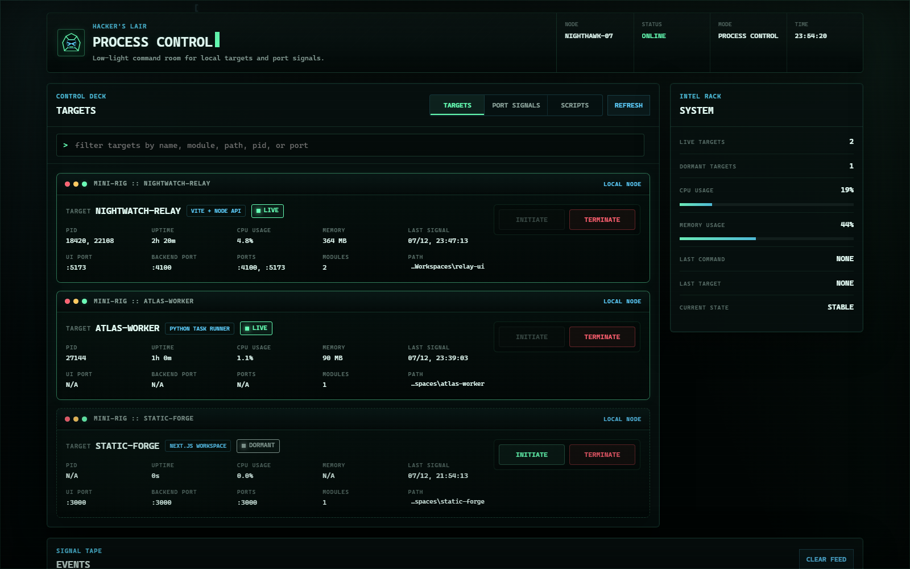
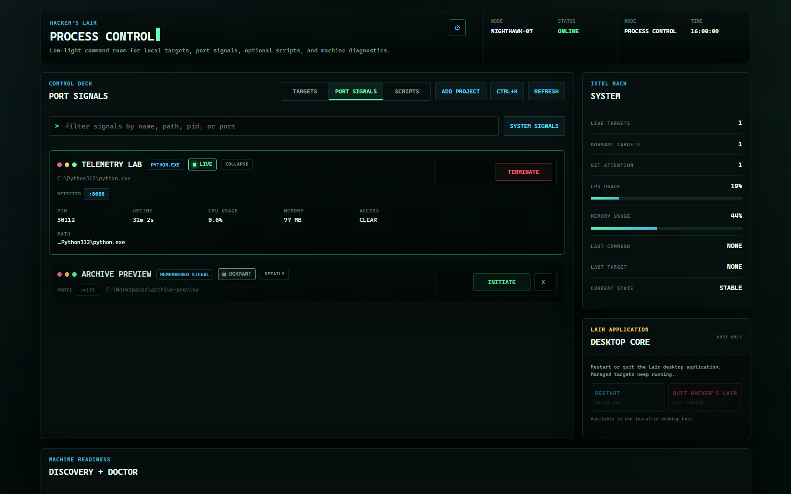
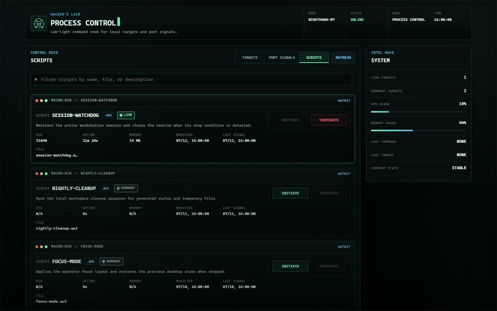
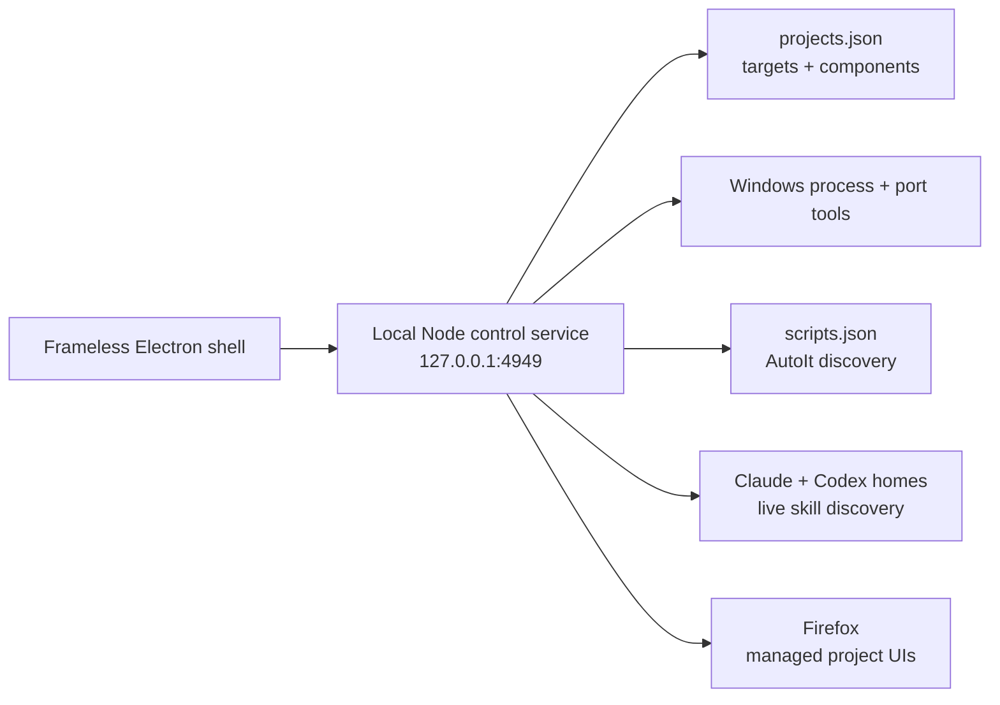

<p align="center">
  
</p>

<h1 align="center">Hacker's Lair</h1>

<p align="center">
  <strong>A frameless Windows command room for projects, localhost ports, and automation scripts.</strong>
</p>

<p align="center">
  
  
  
  
</p>

Hacker's Lair turns a Windows development machine into one focused process
console. Start an entire project, inspect the ports currently listening, launch
local scripts, and open managed web UIs in Firefox without bouncing between
terminal windows, Task Manager, and browser bookmarks.

The interface runs inside a custom Electron shell with its own titlebar,
window controls, and scrollbar. The control service listens only on
`127.0.0.1`.

## Screenshots

### Project targets



### Port signals



### Automation scripts



## Control surfaces

| Surface | What it controls |
|---|---|
| **Targets** | Starts or stops every configured component of a project as one unit, while showing component status, the checked-out Git branch, and logs. |
| **Port Signals** | Shows listening localhost ports, labels known development servers, stops processes, and relaunches processes previously stopped by the console. |
| **Scripts** | Discovers configured AutoIt scripts live and starts or stops them from the same interface. |
| **Skills** | Live-scans personal Claude and Codex skills, identifies which LLM uses each one, and keeps bundled defaults behind an optional filter. |
| **Intel Rack** | Tracks live and dormant targets, CPU and memory pressure, recent commands, and current control state. |
| **Desktop Core** | Runs guarded restart and shutdown sequences for the Electron host without stopping managed projects or the local control service. |
| **Signal Tape** | Keeps an operator-readable event feed for starts, stops, refreshes, and failures. |
| **Cinematic shell** | Runs a short secure-boot handoff, ambient signal rain, scan passes, and subtle operator-mark activity without covering the controls. |

Managed project UIs are opened explicitly in **Firefox**, independent of the
Windows default browser. Set `FIREFOX_PATH` only when Firefox is installed
outside a standard Windows location.

## Architecture



The Node service uses built-in modules and Windows tools such as `netstat`,
`tasklist`, and `taskkill`. Electron is the only npm dependency.

The Intel Rack's **Desktop Core** controls require two clicks within five
seconds. **Restart** relaunches the Electron host; **Shutdown** exits it. Both
leave managed targets and the background localhost control service running.

## Quick start

### Requirements

- Windows 11
- Node.js 18 or newer
- Firefox
- AutoIt 3 only if you want to use the Scripts surface

### Install the desktop app

```powershell
git clone https://github.com/alfonza1/hackers-lair.git
Set-Location hackers-lair
npm install
powershell -ExecutionPolicy Bypass -File .\install.ps1
```

The installer creates Start menu and Desktop shortcuts named **Hacker's Lair**
and registers a silent login-time launcher for the local service. Press the
Windows key, type `Hacker's Lair`, and launch it like any other desktop app.

Re-run `install.ps1` after moving the repository. Use `uninstall.ps1` to remove
the shortcuts and login launcher.

### Run without installing shortcuts

```powershell
npm start
```

For debugging, run the service and desktop host separately:

```powershell
npm run server
npm run desktop
```

The service-only UI is also available at <http://localhost:4949>.

## Configure projects

`projects.json` defines each target and its frontend, backend, or headless
components. Paths and commands are intentionally explicit because detection is
based on the process command line, not only a port number.

To add your own project:

1. Open `projects.json` and add one object inside its top-level `projects`
   array.
2. Add one component for every process Hacker's Lair should start and stop.
3. Set each component's `cwd` to an existing absolute Windows folder and its
   `command` to the same command you would run from that folder in PowerShell.
4. Use a distinctive absolute path or command token for `match`. Hacker's Lair
   uses this value to identify and stop the correct process.
5. Set `port` to the expected listening port. For a worker or bot that never
   opens a port, use `"port": null` and `"track": "process"`.
6. For a service that needs graceful shutdown, such as Docker Compose, set an
   optional `stopCommand`. It runs only when that component is detected live.
7. Save the file and select **Refresh** in Hacker's Lair. The service reads the
   configuration again without a restart.

For example, add this object to the existing `projects` array and replace the
example paths with your own:

```json
{
  "name": "incident-sim",
  "type": "Node monorepo",
  "components": [
    {
      "name": "backend",
      "role": "backend",
      "cwd": "C:\\Code\\incident-sim\\backend",
      "command": "npm run dev",
      "port": 4000,
      "match": "C:\\Code\\incident-sim\\backend"
    },
    {
      "name": "frontend",
      "role": "frontend",
      "cwd": "C:\\Code\\incident-sim\\frontend",
      "command": "npm run dev",
      "port": 5173,
      "match": "C:\\Code\\incident-sim\\frontend"
    }
  ]
}
```

- `cwd` is the component's working directory.
- `command` is launched inside `cwd` in a detached, hidden process.
- `stopCommand` is optional and runs inside `cwd` before any remaining matched
  processes are terminated. It has a 60-second timeout.
- `port` is the expected listening port and is used as a display hint.
- `match` is a distinctive substring in the process command line. An absolute
  project path is the safest default.
- `track: "process"` supports headless components that never bind a port.

The service reloads `projects.json` on every request, so configuration edits do
not require a restart. Replace the checked-in Windows paths with paths for your
own workspace after cloning.

Before refreshing the application, you can validate the JSON from PowerShell:

```powershell
Get-Content -Raw .\projects.json | ConvertFrom-Json | Out-Null
```

No output means the JSON parsed successfully. If the same command or port is
used by several projects, keep every `match` value unique; port numbers alone
are not used to decide which process should be terminated.

## Configure scripts

`scripts.json` points to an AutoIt executable and script directory. Every
`.au3` file in that directory appears automatically, newest modified first.
Descriptions are optional and keyed by filename:

```json
{
  "scriptsDir": "C:\\Scripts\\autoit",
  "autoItExe": "C:\\Program Files (x86)\\AutoIt3\\AutoIt3.exe",
  "descriptions": {
    "watchdog.au3": "Monitors the active session and exits when its stop condition is met."
  }
}
```

To add your own script:

1. Install AutoIt 3 and confirm the location of `AutoIt3.exe`.
2. Create a folder for your `.au3` files, or choose an existing scripts folder.
3. Set `scriptsDir` and `autoItExe` in `scripts.json` to absolute Windows paths.
4. Copy your `.au3` file into `scriptsDir`.
5. Optionally add a `descriptions` entry whose key exactly matches the filename,
   including the `.au3` extension. Scripts without an entry still appear with a
   generic description.
6. Open the **Scripts** surface or select **Refresh**. New files are discovered
   immediately; Hacker's Lair does not need to restart.

Validate the configuration before refreshing:

```powershell
Get-Content -Raw .\scripts.json | ConvertFrom-Json | Out-Null
Test-Path "C:\Program Files (x86)\AutoIt3\AutoIt3.exe"
Test-Path "C:\Scripts\autoit"
```

The two `Test-Path` commands should return `True` after you substitute your
configured executable and folder. Start and stop detection matches the script's
absolute path in the AutoIt process command line, so keep script filenames
distinct within the configured folder.

### Skill discovery

The **Skills** surface reads personal skill metadata directly from
`~/.claude/skills/*/SKILL.md` and `~/.codex/skills/*/SKILL.md`. It re-scans
while the surface is open, so adding, editing, or removing a personal skill
does not require a Hacker's Lair restart.

Personal skills are shown first and identify their Claude or Codex invocation.
The **Default Skills** filter is off initially; enabling it adds Claude's
bundled skill catalog plus Codex system and installed-plugin skills. Only the
skill name, description, LLM, scope, and invocation are sent to the local UI —
home-directory paths are not exposed.

## Repository map

| Path | Responsibility |
|---|---|
| `public/index.html` | Complete Process Control interface and browser-side behavior |
| `server.js` | Local HTTP service, process discovery, launch, stop, and log APIs |
| `lib/skill-registry.js` | Live Claude and Codex skill metadata discovery |
| `desktop.js` | Frameless Electron window lifecycle |
| `preload.js` | Restricted bridge for in-app window controls |
| `projects.json` | Project and component launch configuration |
| `scripts.json` | AutoIt discovery and description configuration |
| `launcher.vbs` | Silent service bootstrap and desktop launcher |
| `install.ps1` / `uninstall.ps1` | Windows shortcut and login registration |
| `make-icon.ps1` / `icon.ico` | Native Hacker's Lair app icon |
| `scripts/capture-readme-screenshots.js` | Regenerates privacy-safe README screenshots with fictional local data |

Run `npm run docs:screenshots` to refresh the README images. The capture uses
Microsoft Edge by default; set `EDGE_PATH` to another Chromium executable when
Edge is installed somewhere else.

## Operational notes

- Runtime logs live under `logs/` and are ignored by Git.
- `started.json` and `stopped.json` retain local launch state and are ignored by
  Git.
- A component startup failure stays visible on its target with the error and a
  link to the full log.
- Closing the Electron window leaves the local service running so the next
  launch is immediate.
- Cinematic effects pause when the app is hidden and are disabled when Windows
  reduced-motion preferences are enabled.

> [!IMPORTANT]
> Process stop actions are real Windows process operations. Keep each `match`
> value distinctive so a target cannot match an unrelated command line.
