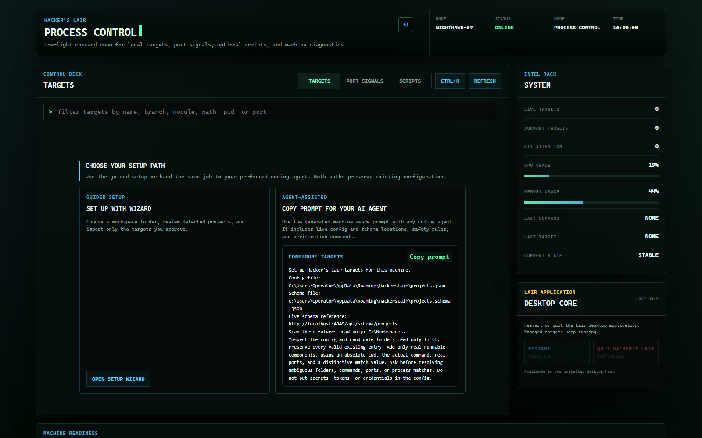
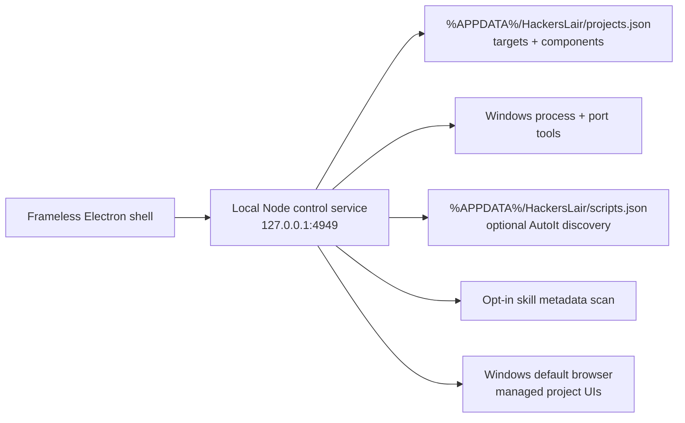

<p align="center">
  
</p>

<h1 align="center">Hacker's Lair</h1>

<p align="center">
  <strong>A frameless Windows command room for projects, localhost ports, and automation scripts.</strong>
</p>

<p align="center">
  
  
  
  
</p>

Hacker's Lair turns a Windows development machine into one focused process
console. Start an entire project, inspect the ports currently listening, launch
local scripts, and open managed web UIs in your default browser without bouncing between
terminal windows, Task Manager, and browser bookmarks.

The interface runs inside a custom Electron shell with its own titlebar,
window controls, and scrollbar. The control service listens only on
`127.0.0.1`.

## Screenshots

### Project targets


### Agent-assisted first run



### Port signals


### Automation scripts


## Control surfaces

| Surface | What it controls |
|---|---|
| **Targets** | Starts or stops every configured component as one unit, shows Git attention and logs, detects announced localhost URLs, resolves port conflicts, and offers Explorer, terminal, VS Code, and copy-command actions. |
| **Port Signals** | Shows listening localhost ports, labels known development servers, stops processes, and relaunches processes previously stopped by the console. |
| **Scripts** | Discovers configured AutoIt scripts live and starts or stops them from the same interface. |
| **Skills** | Optional, explicitly enabled view that scans shared agent skill metadata. It is off in public installs by default. |
| **Discovery + Doctor** | Proposes runnable projects from a folder, offers Vite/Next.js/Spring Boot/FastAPI/Compose templates, then checks tools, paths, ports, config parsing, and data-directory access. Its copyable report redacts usernames and paths. |
| **Intel Rack** | Tracks live and dormant targets, CPU and memory pressure, per-target sparklines, recent commands, and current control state. |
| **Desktop Core** | Runs guarded restart and quit sequences for the Electron host without stopping managed projects or the local control service. |
| **Signal Tape** | Keeps an operator-readable event feed for starts, stops, refreshes, and failures. |
| **Cinematic shell** | Runs a short secure-boot handoff, ambient signal rain, and scan passes without covering the controls. |

Press <kbd>Ctrl</kbd>+<kbd>K</kbd> for the command palette. It fuzzy-filters
start, stop, open, log, Doctor, and config actions. The Electron app also keeps
a tray menu with per-project controls; <kbd>Ctrl</kbd>+<kbd>Shift</kbd>+<kbd>L</kbd>
summons the console globally.

Managed project UIs open in the Windows default browser. Set `BROWSER_PATH` or
`browserPath` in `%APPDATA%\HackersLair\settings.json` only when you want a
specific browser executable. `FIREFOX_PATH` remains a backwards-compatible
override.

Git attention is read-only. Each target reports its total local commit count,
working-tree changes, upstream divergence, missing upstream, detached HEAD, and
dirty protected-branch state. Hacker's Lair does not stage, commit, reset, pull,
or push repositories.

When no targets are configured, the empty view provides
copyable prompts for a coding agent. The service inserts the current machine's
real AppData configuration path (and the shared skills path only after opt-in), while the prompt tells the agent
to inspect first, preserve existing files, ask about ambiguity, validate the
result, and verify it in the running app.

## Architecture



The Node service uses built-in modules and Windows tools such as `netstat`,
`tasklist`, and `taskkill`. Electron is the only npm dependency.

The Intel Rack's **Desktop Core** controls require two clicks within five
seconds. **Restart** relaunches the Electron host; **Quit Hacker's Lair** exits it. Both
leave managed targets and the background localhost control service running.

## Quick start

### Requirements

- Windows 11
- Node.js 22.12 or newer
- AutoIt 3 only if you want to use the Scripts surface

### Install the desktop app

```powershell
git clone https://github.com/alfonza1/hackers-lair.git
Set-Location hackers-lair
npm install
powershell -ExecutionPolicy Bypass -File .\install.ps1
```

The installer creates Start menu and Desktop shortcuts named **Hacker's Lair**,
installs the `lair` command shim, adds it to the user PATH, and registers a
silent login-time launcher for the local service. Press the
Windows key, type `Hacker's Lair`, and launch it like any other desktop app.

Re-run `install.ps1` after moving the repository. Use `uninstall.ps1` to remove
the shortcuts and login launcher. Pass `-NoStartup` to install without the
login launcher. Uninstall prompts before deleting `%APPDATA%\HackersLair`; use
`-DeleteData` or `-KeepData` for a non-interactive choice.

When upgrading from an older Hacker's Lair icon, close the desktop app, unpin
the existing taskbar entry, run `install.ps1`, launch the refreshed Start menu
or Desktop shortcut, and pin that running instance. The installer assigns the
same Windows app identity to the shortcut and Electron process so future
launches stay grouped under the native command-line icon.

### Run without installing shortcuts

```powershell
npm start
```

For debugging, run the service and desktop host separately:

```powershell
npm run server
npm run desktop
```

The service starts at port 4949 and may use 4950–4959 if needed. The verified
port, launch nonce, PID, and private mutation token live in
`%APPDATA%\HackersLair\api-token`; the desktop launcher verifies the identity
before loading the UI.

### Use the terminal companion

The CLI reads the same rotating AppData identity record as the desktop host,
verifies the per-launch nonce, and sends the private token only to the verified
localhost service.

```powershell
lair ls
lair start "My Project"
lair stop "My Project"
lair open "My Project"
lair doctor
lair backups
lair restore 2026-07-26T12-00-00-000Z.json
```

## Configure projects

`%APPDATA%\HackersLair\projects.json` defines each target and its frontend, backend, Docker stack, or
headless components. Docker stacks declare their published `ports` as the
authoritative readiness signal, so Hacker's Lair recognizes containers started
inside or outside the app even though Docker owns the Windows listener process.
The file includes `"$schema": "./projects.schema.json"` by default. Hacker's
Lair copies the bundled schema beside the user config, so VS Code autocomplete,
server-side validation, and the in-app field reference all use the same offline
source.

To add your own project:

1. Use **Discovery + Doctor → Scan folder** to review detected projects, or
   open `%APPDATA%\HackersLair\projects.json` and add one object inside its
   top-level `projects` array.
2. Add one component for every command Hacker's Lair should start and stop. A
   Docker Compose project should normally be one `stack` component.
3. Set each component's `cwd` to an existing absolute Windows folder and its
   `command` to the same command you would run from that folder in PowerShell.
4. Use a distinctive absolute path or command token for `match`. Hacker's Lair
   uses this value to identify and stop the correct process.
5. For Docker, set `ports` to the project's unique published readiness ports.
   All must be listening before the stack is reported running. Use optional
   `uiPorts` and `backendPorts` to classify them on the target card.
6. Set `stopCommand` for Docker Compose. It runs when any declared port is live,
   including when the stack was started outside Hacker's Lair.
7. Save the file and select **Refresh** in Hacker's Lair. The service reads the
   configuration again without a restart.

For example, add this object to the empty `projects` array and replace the
example paths with your own:

```json
{
  "name": "sample-docker-stack",
  "type": "Docker Compose",
  "components": [
    {
      "name": "stack",
      "role": "fullstack",
      "cwd": "C:\\Code\\sample-docker-stack",
      "command": "docker compose -p sample-docker-stack up --build",
      "stopCommand": "docker compose -p sample-docker-stack down",
      "ports": [5173, 4000],
      "uiPorts": [5173],
      "backendPorts": [4000],
      "track": "process",
      "match": "-p sample-docker-stack up"
    }
  ]
}
```

- `cwd` is the component's working directory.
- `command` is launched inside `cwd` in a detached, hidden process.
- `stopCommand` is optional and runs inside `cwd` before any remaining matched
  processes are terminated. It has a 60-second timeout.
- After termination, every configured process and port is checked for up to
  five seconds. If a live signal remains, the target stays live and the
  interface reports a failed termination instead of claiming it is dormant.
- `ports` opts into authoritative port detection. Keep these published ports
  unique across projects; all declared ports are required for the running state.
- `uiPorts` and `backendPorts` control where declared ports appear on the card.
- Legacy `port` is a display/readiness hint for command-line-matched processes.
- `detectByPort: true` remains supported for older single-port configurations.
- `match` is a distinctive substring in the process command line. An absolute
  project path is the safest default.
- `track: "process"` supports headless components that never bind a port.
- `autoRestart: true` opts a component into capped exponential-backoff restart
  after an unexpected exit. `maxRestarts` defaults to 3 and is capped at 10.
- `zombieAfterHours` overrides the global idle threshold for a component.
  Components over the threshold with no established connections are flagged
  for one-click shutdown.

The service reloads the user configuration on every request, so edits do not
require a restart. If JSON becomes invalid, the last known-good configuration
stays active and the UI displays the exact parse failure. Only sanitized
`projects.example.json`, `scripts.example.json`, and `settings.example.json`
are tracked; personal paths are never package or repository content.

Every in-app config write first creates a version under
`%APPDATA%\HackersLair\backups\projects`; the newest ten are retained. **Restore
Previous** also backs up the current version before restoring. Redacted export
removes usernames and absolute paths for sharing; import validates the same
JSON Schema before merging non-duplicate project names.

Before refreshing the application, you can validate the JSON from PowerShell:

```powershell
Get-Content -Raw "$env:APPDATA\HackersLair\projects.json" | ConvertFrom-Json | Out-Null
```

No output means the JSON parsed successfully. Authoritative `ports` must be
unique across projects. Legacy components may share defaults such as `3000`
because their distinctive `match` value still identifies the owning process.

## Configure scripts

`%APPDATA%\HackersLair\scripts.json` points to an AutoIt executable and script directory. Every
`.au3` file in that directory appears automatically, newest modified first.
The checked-in values are empty so local script paths and descriptions are not
published. Descriptions are optional and keyed by filename:

```json
{
  "scriptsDir": "C:\\Scripts\\autoit",
  "autoItExe": "C:\\Program Files (x86)\\AutoIt3\\AutoIt3.exe",
  "descriptions": {
    "watchdog.au3": "Monitors the active session and exits when its stop condition is met."
  }
}
```

To add your own script:

1. Install AutoIt 3 and confirm the location of `AutoIt3.exe`.
2. Create a folder for your `.au3` files, or choose an existing scripts folder.
3. Set `scriptsDir` and `autoItExe` in `%APPDATA%\HackersLair\scripts.json` to absolute Windows paths.
4. Copy your `.au3` file into `scriptsDir`.
5. Optionally add a `descriptions` entry whose key exactly matches the filename,
   including the `.au3` extension. Scripts without an entry still appear with a
   generic description.
6. Open the **Scripts** surface or select **Refresh**. New files are discovered
   immediately; Hacker's Lair does not need to restart.

Validate the configuration before refreshing:

```powershell
Get-Content -Raw "$env:APPDATA\HackersLair\scripts.json" | ConvertFrom-Json | Out-Null
Test-Path "C:\Program Files (x86)\AutoIt3\AutoIt3.exe"
Test-Path "C:\Scripts\autoit"
```

The two `Test-Path` commands should return `True` after you substitute your
configured executable and folder. Start and stop detection matches the script's
absolute path in the AutoIt process command line, so keep script filenames
distinct within the configured folder.

### Skill discovery

The **Skills** surface is disabled by default because it reads outside the
install directory. Set `"enableSkills": true` in
`%APPDATA%\HackersLair\settings.json` to opt in. It then reads personal skill
metadata directly from the shared workspace `.agents/skills/*/SKILL.md` folder. It re-scans while the surface is
open, so adding, editing, or removing a personal skill does not require a
Hacker's Lair restart.

Personal skills are shown first as shared workspace capabilities. Selecting
**Default Skills** switches to an exclusive view of bundled, system, and
installed-plugin skills; selecting **Personal Skills** switches back. Only
skill metadata is sent to the local UI; filesystem paths are not exposed.

## Repository map

| Path | Responsibility |
|---|---|
| `public/index.html` | Complete Process Control interface and browser-side behavior |
| `server.js` | Local HTTP service, process discovery, launch, stop, and log APIs |
| `lib/skill-registry.js` | Live shared and default agent skill metadata discovery |
| `lib/git-attention.js` | Read-only Git working-tree and upstream attention state |
| `lib/onboarding-prompts.js` | Portable first-run prompts using live machine paths |
| `lib/schema-validator.js` / `schemas/projects.schema.json` | Dependency-free config validation and the shared offline schema |
| `lib/project-templates.js` | Smart defaults for common local development layouts |
| `lib/redaction.js` / `lib/doctor.js` | Privacy-safe exports and support diagnostics |
| `bin/lair.js` | Token-authenticated local CLI companion |
| `desktop.js` | Frameless Electron window, tray, and global-hotkey lifecycle |
| `app-config.js` | Shared desktop name, Windows app identity, and icon-cache version |
| `preload.js` | Restricted bridge for in-app window controls |
| `projects.example.json` | Sanitized seed for user-owned project configuration |
| `scripts.example.json` / `settings.example.json` | Sanitized seeds for optional features |
| `launcher.vbs` | Silent service bootstrap and desktop launcher |
| `install.ps1` / `uninstall.ps1` | Windows shortcut and login registration |
| `scripts/install-shortcuts.js` | Creates Windows shortcuts with matching Electron taskbar metadata |
| `make-icon.ps1` / `icon.ico` | Native Hacker's Lair app icon |
| `scripts/capture-readme-screenshots.js` | Regenerates privacy-safe README screenshots with fictional local data |

Run `npm run docs:screenshots` to refresh the README images. The capture uses
Microsoft Edge by default; set `EDGE_PATH` to another Chromium executable when
Edge is installed somewhere else.

## Operational notes

- Runtime logs and all state/config files live under
  `%APPDATA%\HackersLair` (or `PROJECT_MANAGER_DATA_DIR`) and are ignored by Git.
- A component startup failure stays visible on its target with the error and a
  link to the full log.
- Closing the Electron window hides it to the tray and leaves the local service
  running. Use **Quit Hacker's Lair** or the tray Quit action to exit the host.
- Component logs are scanned locally for `localhost` and `127.0.0.1` URLs.
  Nothing is uploaded, and every feature works without an account or network
  service.
- If a managed start reports `EADDRINUSE`, the target identifies the owning PID
  and can terminate that process before retrying. Protected and self-owned
  processes remain blocked.
- The boot sequence plays once. **Replay Intro** re-enables it; cinematic
  effects pause when hidden and respect Windows reduced-motion preferences.
- Every request validates the exact localhost Host header. Every mutation also
  requires JSON and a per-launch secret injected only into the served HTML.

> [!IMPORTANT]
> Process stop actions are real Windows process operations. Keep each `match`
> value distinctive so a target cannot match an unrelated command line.
